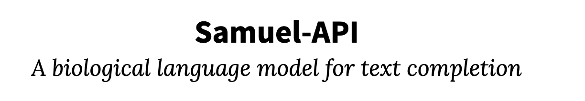

Samuel is a biological language model.
He is available as a text completion API at [samuel-api.com](https://samuel-api.com).

<iframe class='fitvidsignore' width='360px' height='640px' src='https://www.youtube.com/embed/0F9FSKuj3bA' frameborder='0' allow='accelerometer; encrypted-media; gyroscope; picture-in-picture' allowfullscreen='allowfullscreen'>&nbsp;</iframe>

Please file API bug reports as issues in the [issue tracker](https://github.com/albanie/samuel-api/issues/).